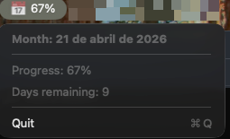

# 📅 Monthage

A tiny macOS menubar app that shows what percentage of the current month has elapsed.



## Why?

To track time vs. your subscription usage (AI, data, etc.). If you've used 60% of your quota and you're at 82% of the month... you're cutting it close.

## Requirements

- macOS 13.0+

## Installation

### Option 1: Homebrew (Recommended)

```bash
brew tap aarizkuren/monthage
brew install --cask monthage
```

### Option 2: Download Release

1. Go to [Releases](../../releases) and download the latest `Monthage.app.zip`
2. Unzip and drag `Monthage.app` to Applications
3. If macOS blocks it: System Preferences → Privacy & Security → Allow

### Option 3: Build from Source

```bash
git clone https://github.com/aarizkuren/monthage.git
cd monthage
swift build -c release
open .build/release/Monthage
```

## Usage

- Icon appears in menubar: `📅 67%`
- Click to see: current month, % elapsed, days remaining
- Cmd+Q to quit

## Features

- Auto-updates every hour
- No dock icon (menubar only)
- Dark mode compatible
- Ready for future API integrations (Anthropic, OpenAI, etc.)

## License

MIT © [aarizkuren](https://github.com/aarizkuren)
